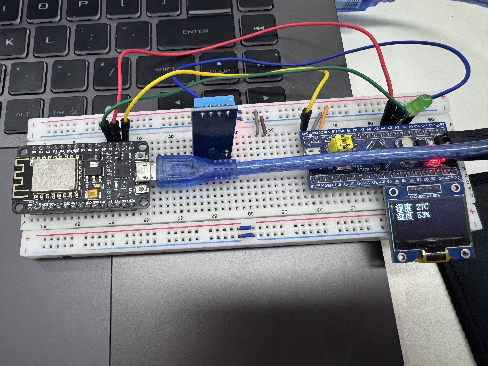
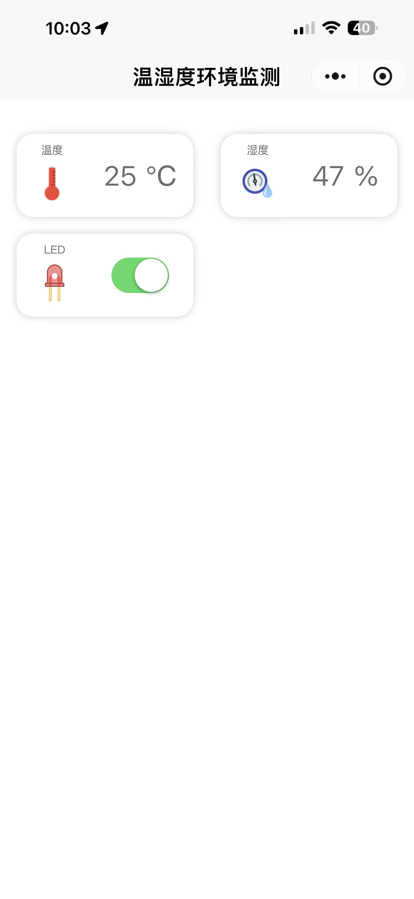

# STM32 Environmental Monitor

An IoT environmental monitoring device based on STM32F103C8, using ESP8266 Wi-Fi module to upload temperature and humidity data to the OneNET cloud platform via MQTT protocol.

## 效果展示





## Hardware Overview

| Component | Model / Type | Function |
|-----------|-------------|----------|
| MCU | STM32F103C8T6 | Core controller (Cortex-M3, 72 MHz) |
| Wi-Fi Module | ESP8266 | Network connectivity (UART interface) |
| Sensor | DHT11 | Temperature & Humidity measurement |
| Display | 0.96" OLED (SSD1306) | Local data visualization |
| Indicator | LED | Connection status |
| Alarm | Buzzer | Alert beeps on boot |
| Input | Keys | User interaction |
| Light Sensor | Analog input | Ambient light detection |

## Platform & Cloud

- **Development IDE**: Keil MDK (ARM-ADS / ARMCC V5.06)
- **Cloud Platform**: [OneNET](https://open.iot.10086.cn/) (China Mobile IoT platform)
- **Communication Protocol**: MQTT over TCP (port 1883, `mqtts.heclouds.com`)
- **Data Format**: JSON (parsed via cJSON library)
- **Authentication**: HMAC-SHA1 + Base64 token-based authorization

## Project Structure

```
EnvironmentalMonitor/
├── User/                          # Application entry point
│   ├── main.c                     # Main program: init, loop, sensor polling
│   ├── stm32f10x_it.c             # Interrupt handlers (NMI, HardFault, etc.)
│   └── stm32f10x_conf.h           # Peripheral library includes
├── Hardware/                      # Hardware abstraction layer (HAL)
│   ├── DHT11.c / .h               # DHT11 temperature & humidity sensor driver
│   ├── OLED.c / .h                # SSD1306 OLED display driver
│   ├── OLED_Font.h                # Chinese & ASCII font lookup table
│   ├── LED.c / .h                 # LED control
│   ├── BUZZER.c / .h              # Buzzer control
│   ├── KEY.c / .h                 # Key scanning
│   ├── LightSensor.c / .h         # ADC-based light sensor
│   ├── ESP8266.c / .h             # ESP8266 AT-command wrapper
│   ├── USART.c / .h               # UART driver (USART1 debug, USART2 Wi-Fi)
│   └── Delay.c / .h               # Software delay utilities
├── NET/                           # Network & cloud layer
│   ├── MQTT/
│   │   ├── MqttKit.c / .h         # MQTT packet encode/decode (connect, publish, subscribe, ping)
│   │   ├── Common.h               # Basic type definitions
│   │   └── sample.c               # SDK usage examples
│   ├── onenet/
│   │   ├── onenet.c / .h          # OneNET platform integration (auth, publish, subscribe, recv)
│   │   ├── base64.c / .h          # Base64 encoding/decoding
│   │   └── hmac_sha1.c / .h       # HMAC-SHA1 for OneNET authentication
│   ├── CJSON/
│   │   ├── cJSON.c / .h           # Lightweight JSON parser/generator
│   └── device/
│       └── esp8266.c / .h         # ESP8266 device driver (alternative implementation)
├── Start/                         # CMSIS & startup files
│   ├── core_cm3.c / .h            # Cortex-M3 core support
│   ├── system_stm32f10x.c / .h    # System initialization (clock, flash)
│   └── stm32f10x.h                # STM32F10x register definitions
├── Library/                       # STM32 Standard Peripheral Library
│   ├── stm32f10x_gpio.c / .h
│   ├── stm32f10x_usart.c / .h
│   ├── stm32f10x_adc.c / .h
│   ├── stm32f10x_tim.c / .h
│   ├── stm32f10x_spi.c / .h
│   ├── stm32f10x_i2c.c / .h
│   ├── stm32f10x_dma.c / .h
│   └── ...                        (other peripherals: RCC, EXTI, FLASH, RTC, etc.)
├── .cmsis/                        # ARM CMSIS pack (multi-core device support)
├── EnvironmentalMonitor.uvprojx   # Keil MDK project file
└── EnvironmentalMonitor.uvoptx    # Keil workspace options
```

## Key Features

1. **DHT11 Sensor Reading** — Polls temperature and humidity at regular intervals via a GPIO bit-banging interface.
2. **OLED Display** — Shows Chinese labels ("温度", "湿度") and numeric values on a 0.96" I2C OLED screen.
3. **ESP8266 Wi-Fi** — Connects to a Wi-Fi network (configured in `esp8266.c`), establishes a TCP connection to OneNET's MQTT broker, and performs MQTT handshake.
4. **MQTT Communication** — Full MQTT client implementation supporting CONNECT, PUBLISH, SUBSCRIBE, and PING KEEPALIVE packets at QoS 0.
5. **OneNET Cloud Upload** — Sends sensor data as JSON payloads using the OneNET Thing Specification Model (`$sys/{product_id}/{device_name}/thing/property/post`).
6. **Remote Control** — Subscribes to the property set topic to receive commands from OneNET (e.g., toggle LED on/off).
7. **Boot Sequence** — Buzzer beeps once on startup; LED blinks during data transmission cycles.

## Data Flow

```
DHT11 Sensor → STM32F103 (GPIO) → OLED Display (local)
                            ↓
                    ESP8266 (USART2) → Wi-Fi
                            ↓
                    MQTT over TCP → mqtts.heclouds.com:1883
                            ↓
                    OneNET Cloud Platform
                            ↓
                    ← Subscribe topic ← Remote commands (LED control, etc.)
```

## Build Instructions

1. Open `EnvironmentalMonitor.uvprojx` in **Keil MDK-ARM**.
2. Select the **ARMCC V5.06** toolchain.
3. Configure the target device: **STM32F103C8** (64 KB Flash, 20 KB RAM).
4. Set the system clock to **72 MHz** (external HSE 8 MHz, PLL ×9).
5. Build the project (**F7** or **Build target**).
6. Flash via ST-Link or DAP-Link debugger.

## Configuration

Before deploying, update the following in the source code:

| File | Variable | Description |
|------|----------|-------------|
| `Hardware/ESP8266.c` | `ESP8266_WIFI_INFO` | Wi-Fi SSID and password |
| `NET/onenet/src/onenet.c` | `PROID` | OneNET Product ID |
| `NET/onenet/src/onenet.c` | `ACCESS_KEY` | OneNET device master key |
| `NET/onenet/src/onenet.c` | `DEVICE_NAME` | Device name registered on OneNET |

## Technical Details

- **MCU Clock**: 72 MHz (HSE 8 MHz → PLL ×9)
- **Stack Size**: Default (adjust in startup file if needed)
- **Heap**: Uses `malloc`/`free` from CMSIS (configure in `scatter load file` for larger buffers)
- **Debug UART**: USART1 (115200 baud, 8-N-1)
- **Wi-Fi UART**: USART2 (115200 baud, 8-N-1)
- **Sensor Interface**: DHT11 (single-wire GPIO), Light Sensor (ADC channel)
- **Display Interface**: I2C (PB6=SCL, PB7=SDA typical for SSD1306)
- **MQTT Keepalive**: 60 seconds

## License

This project is provided as-is for educational and IoT development purposes.
